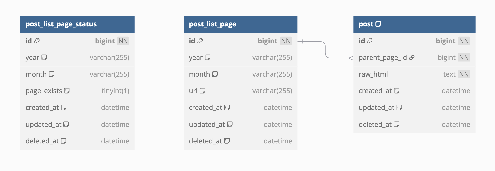

### 소개
web archive에 아카이빙된 페이지를 쉽게 탐색할 수 있도록 인덱스 페이지를 생성 및 제공하는 서비스

### 문제 정의
- 애자일 이야기는 자주 들르던 블로그다. 이 블로그를 제공하던 이글루스가 서비스를 종료한 이후, 블로그 글을 읽을 수 있는 곳은 web archive에 아카이빙된 페이지다
- 그러나 블로그 특성상 모든 게시물을 한 번에 확인할 수 없고, web archive 서버 응답 속도가 매우 느려 원하는 게시글을 찾는 과정이 번거롭다

### 해결 방안
- 모든 게시물에 대한 링크를 한 번에 확인할 수 있는 인덱스 페이지를 제공해서 이러한 불편함을 완화한다
  - [배포된 애자일 이야기 블로그 인덱스 페이지](https://genidxpage-static.fly.dev/)
- 사람의 개입을 최대한 줄이면서도 인덱스 페이지의 정합성을 보장하는 것을 목표로 한다. (서비스 종료된 블로그이므로) 블로그에 새 글이 추가되지 않지만, web archive에 아카이빙된 자료의 접근 가능 여부는 바뀔 수 있다. 이 변동성을 사람이 수동으로 관리하는 것보다는 가능한 자동화된 방식으로 감시하고 갱신하는 것이 효율적이라고 판단했다

### 작동 방식
#### 인덱스 생성
- [x] 대상 블로그의 모든 연월(YYYY/MM) 조합으로 web archive에 요청을 보낸다
- [x] web archive 서버 응답을 기반으로 인덱스 파일을 만든다
### 인덱스 파일 배포
- [x] 인덱스 파일을 클라우드 서버(fly.io)에 배포해서 여러 사람이 쓸 수 있게 한다
- [x] 스케줄링 시마다 생성되는 [인덱스 파일을 자동 배포](https://github.com/rogarithm/gen-idx-page/issues/81)한다
- [ ] 스프링 앱 ec2 배포를 자동화한다
#### 정합성 유지
- [x] 인덱스 생성 작업을 매일 일정 시점에 백드라운드에서 수행한다
- [x] 유효한 접근 url을 얻지 못한 요청은 따로 모아 재시도한다
- [ ] 인덱스 파일에 기록된 접근 url로 아카이빙된 페이지에 실제로 접근 가능한지 검증한다

### 개발 정책
개발 중 발생할 수 있는 오류를 사전에 방지하거나 쉽게 파악할 수 있도록 하고, 개발 일관성을 지킬 수 있는 정책과 도구를 적용한다. 현재까지 다음과 같은 정책과 도구를 적용했다:

- 브랜치 네이밍 정책: [pre-push 훅으로 브랜치 이름 규칙을 강제한다](https://github.com/rogarithm/gen-idx-page/pull/9)
- 코드 포맷 일관성 유지: [checkstyle, .editorconfig, intelliJ 포맷터를 설정하고, pre-push 훅과 깃헙액션에서 자동 검증한다](https://github.com/rogarithm/gen-idx-page/pulls?q=is%3Apr+is%3Aclosed+label%3Aformatting)
- 테스트 자동화: 테스트를 작성하고, [pre-push 훅과 깃헙액션에서 테스트 통과 여부를 확인한다](https://github.com/rogarithm/gen-idx-page/pull/40)
- MyBatis SQL 문법 검증: [XML에 정의된 SQL 문이 올바른지 검증한다](https://github.com/rogarithm/gen-idx-page/blob/c0d28d02fe6e5916426ef98fc178a3aa1a93e45c/hooks/check_sql.rb). 루비 스크립트는 XML 내 SQL만 추출해 스키마 SQL 파일을 참고해 sql 문법 검사기인 sqlfluff에서 분석할 수 있는 형태로 바꾸고, pre-commit 훅으로 커밋 전마다 실행한다
- 정적 분석: [PMD 툴로 소스 코드 정적 분석한다](https://github.com/rogarithm/gen-idx-page/pull/80)

### ERD

